# Manhaji — Phase 1 Build-Status Report
### What has been built, what hasn't, screen by screen

**Prepared:** 10 July 2026 · **For:** Elias / Manhaji leadership · **By:** Manhaji PM review
**Scope:** the live website `manhaji-bay.vercel.app` — all four user types (Admin, Teacher, Parent, Student) — measured against the Phase 1 screens we isolated in the June handover.

---

## How to read this document

Every screen is given one of four plain-English status badges:

| Badge | Meaning |
|---|---|
| ✅ **Live** | Built **and** showing your real school data. |
| 🟡 **Demo** | Built and looks complete, but the numbers on screen are **placeholder/sample data**, not your real school data yet. |
| 🟠 **Partial** | Part of it is built; important pieces are missing, disabled, or not wired up. |
| 🔴 **Missing / Broken** | Not built at all, or built but it doesn't work. |

The document is in three layers, exactly as requested:
1. **Status summary** — the big picture in one page.
2. **Screen by screen** — for each screen: its status, then the **visuals & functions built**, then the **visuals & functions not built**, then **what it needs going forward**.
3. **Going-forward plan** — the overall roadmap to finish Phase 1.

---

# 1 · Status summary

### The one-sentence headline
**The website is a beautifully finished shell that is almost entirely running on sample data.** Nearly every Phase 1 screen has been designed and built to a high visual standard — but only **two screens are actually connected to your real school database**, three intended screens are **missing**, and one **repeating link bug** breaks navigation across two dashboards.

### The picture in numbers
Of the **21 Phase 1 screens** we isolated:

- **~18 are visually built** (the layouts, controls and content are there).
- **Only 2 are genuinely wired to your live database** — the **Faculty roster** (69 teachers pulled from the database) and **Section Mapping** (82 real section codes). Everything else displays convincing but **placeholder** data.
- **3 are missing entirely:** an Admin student‑attendance analytics screen, teacher-side goal setting, and an admin "manage other admins" screen.
- **Several controls are disabled or dead:** the bulk-parent-comms "Send" button, the roster "Upload" button, and every dashboard summary card (they link to broken addresses).

### The two-axis scorecard
The honest way to see it: **"Is the screen built?"** is mostly *yes*. **"Does it show real data and actually work?"** is mostly *not yet*.

| # | Screen | Built (UI)? | Real data / works? | Verdict |
|---|--------|:---:|:---:|---|
| A1 | Auth & Manage Admins | Login ✅ / Mgmt ❌ | Login works | 🟠 Partial |
| A2 | Admin Dashboard | ✅ | Cards link is broken | 🟠 Partial |
| A3 | Input Data (create/edit) | ✅ | Section-mapping real; rest disabled | 🟠 Partial |
| A4 | Faculty / HR | ✅ | Roster **real**; load/dept blank; no leave queue | 🟠 Partial |
| A5 | Students (at-risk / admissions) | ✅ | Small real-ish data; split over 2 pages | 🟡 Demo |
| A6 | Admin Attendance analytics | ❌ | — | 🔴 Missing |
| A7 | Schedule + auto-scheduling | Coverage ✅ / Generator ❌ | Demo data | 🟠 Partial |
| A8 | Reports (regulator + parent comms) | Regulator ✅ / Comms ❌ | Demo; comms disabled | 🟠 Partial |
| T1 | One-Tap Attendance | ✅ | Demo; Submit saves nothing | 🟡 Demo |
| T2 | Rubric Scoring | ✅ | Demo | 🟡 Demo |
| T3 | Class Summary / Lesson Plan | ✅ | Demo | 🟡 Demo |
| T6 | Substitute Handoff | ✅ | Demo | 🟡 Demo |
| — | Teacher goal-setting | ❌ | — | 🔴 Missing |
| P1 | Parent Weekly Digest | ✅ | Demo | 🟡 Demo |
| P4 | Permission Slip | ✅ | Demo | 🟡 Demo |
| P5 | Invoice / Payment | ✅ | Demo; pay = external portal | 🟡 Demo |
| P6 | Sibling Comparison | ✅ | Demo | 🟡 Demo |
| S1 | Student Goals | ✅ | Demo | 🟡 Demo |
| S2 | Study Planner | ✅ | Demo | 🟡 Demo |
| S3 | University / Application Tracker | ✅ | Demo | 🟡 Demo |

**Bonus screens built beyond the Phase 1 list:** parent Calendar (with real calendar-sync links), a bilingual parent Course-Selection wizard, and a rich student "My Growth" analytics page.

### The six things that most need attention
1. **The link bug** — every big summary card on the Admin and Student dashboards (and the Admin "Input Data" cards) points to a broken address and lands on a "page not found." One fix clears all of them. *(Highest visibility, lowest effort.)*
2. **Real data is barely connected** — only the faculty roster and section list read from your database. To be a real product, the screens need to be plugged into live data.
3. **Nothing you type is saved yet** — the key "save" actions (submit attendance, etc.) don't write anything.
4. **AI is offline** — every "Ask Manhaj" / "Generate" button has no working engine behind it.
5. **Three screens are missing** — admin attendance analytics, teacher goal-setting, manage-admins.
6. **Two live databases** — the app still runs on the old database copy; the migration to the new one was never finished (covered in the separate cutover runbook).

> **Important context:** this site is your **external developer's** deployment, and its source code isn't yet in your repository — so these findings double as a precise work order for them.

---

# 2 · Screen by screen

*Each screenshot below is the current live screen. "Built" = what's there and working as a demo; "Not built" = missing, disabled, or not connected to real data.*

## ADMIN

### A1 · Login & Manage Admins — 🟠 Partial
Login and the one-click demo picker work. There is **no screen for a principal to invite or manage other admins**.
- **Built:** email/password login; magic-link option; one-click demo role picker; correct redirects and role guards.
- **Not built:** the "Manage Admins / invite an admin or advisor" screen (intended A1); real invitation emails.
- **Going forward:** build the manage-admins screen once real accounts replace the demo logins.

### A2 · Admin Dashboard — 🟠 Partial
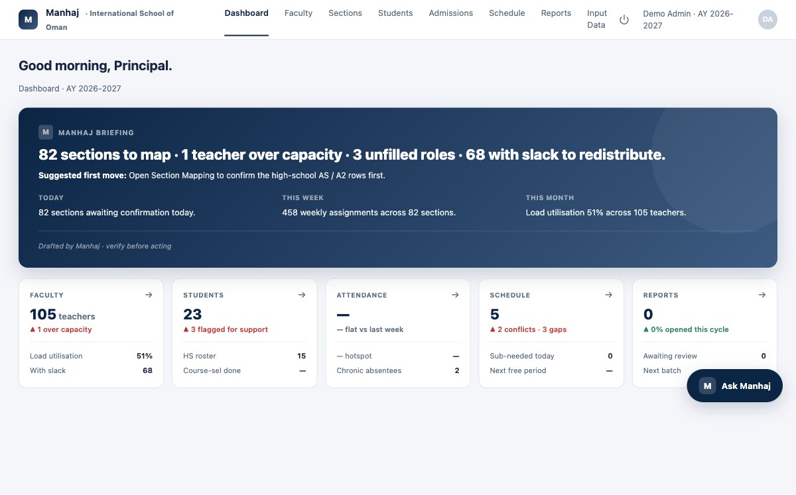
The principal's morning view: an AI "briefing" and five summary cards (Faculty, Students, Attendance, Schedule, Reports).
- **Built:** the layout; the AI briefing text; the five cards; the teacher count (105) and student count (23) show through.
- **Not built / broken:** **all five cards link to broken addresses** and open a "page not found"; Attendance and Reports cards show blanks ("—"/0); the briefing wording is sample text, not generated from live data.
- **Going forward:** fix the card links (one shared fix); connect each card's numbers to live data; wire the AI briefing.

### A3 · Input Data (create & edit records) — 🟠 Partial
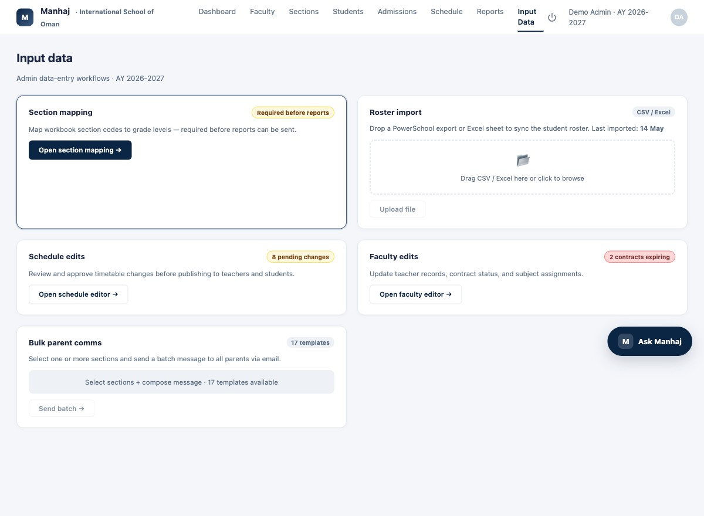
Intended as the one trusted place to add/edit students, teachers, parents and map sections.
- **Built:** the five workflow cards; **Section Mapping is genuinely built and connected** (see below).
- **Not built / broken:** the **"Upload file" (roster import) button is disabled**; the **"Send batch" (bulk parent comms) button is disabled**; three of the cards link to broken addresses; no ad-hoc create/edit forms for students/teachers/parents yet.
- **Going forward:** enable roster import; build the simple create/edit forms; fix the card links.

### A3b · Section Mapping — ✅ Live
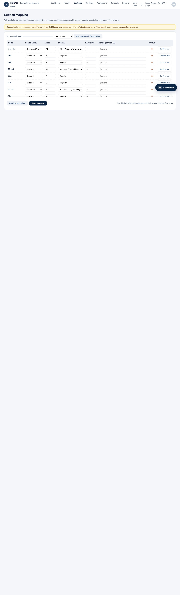
- **Built (and real):** **82 real section codes loaded from your database** (1-2 AL, 10A, 11 AS…), each row editable — grade, label, stream, capacity, notes — with a "Confirm" per row and "0 / 82 confirmed" progress. This is a genuine working data-entry workflow.
- **Not built:** confirmations may not yet persist back to the database (needs verification); "Re-suggest all from codes" behaviour unverified.
- **Going forward:** confirm the save path writes to the database; this screen is the template for the other Input-Data editors.

### A4 · Faculty / HR — 🟠 Partial
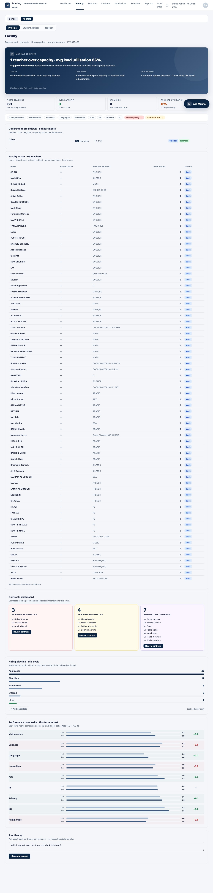
- **Built:** three viewpoints (Principal / Advisor / Teacher); **the roster reads 69 real teachers from the database** with real names and subjects; contracts, hiring funnel and department-performance panels are all laid out.
- **Not built / not wired:** every teacher shows **0 periods/week and department "Other"** — the workload and department data isn't connected (the data exists in the database, it just isn't joined in); the roster **under-counts (69 shown vs 105 in the database)**; the **sick-leave approval queue (a Phase 1 requirement) is absent**; contracts / hiring / performance are placeholder numbers.
- **Going forward:** connect teacher workload + department; show all 105; build the sick-leave approval queue; replace placeholder HR panels with real data.

### A5 · Students (at-risk & admissions) — 🟡 Demo
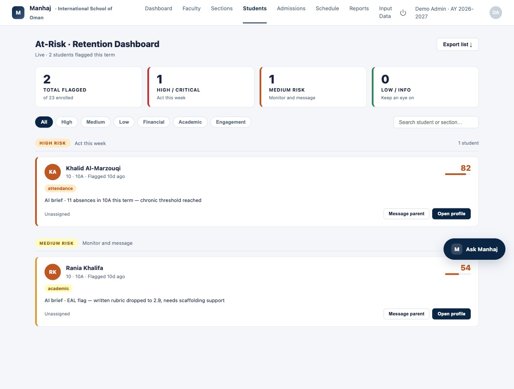
The at-risk / retention view. Re-enrolment, leavers and the applicant pipeline live on a **separate** page (currently the "Admissions" screen).
- **Built:** at-risk dashboard (flagged students, risk levels, filters, search); admissions screen with re-enrolment, confirmed leavers and an applicant pipeline table (add/export).
- **Not built / issues:** the two halves are **split across two routes** rather than one Students area; most figures are placeholder (small real-ish at-risk and applicant cohorts); action buttons ("Open profile", "Message parent") do nothing.
- **Going forward:** bring the two halves under one Students area; wire the buttons; connect to live student data.

### A6 · Admin Attendance analytics — 🔴 Missing
There is **no admin screen for student-attendance patterns / chronic-absentee analysis**. The `/admin/attendance` address actually opens the **Admissions** screen. (Attendance *capture* exists on the teacher side — see T1.)
- **Going forward:** build the admin attendance-analytics screen (patterns, chronic absentees), fed by the teacher attendance capture.

### A7 · Schedule + Auto-Scheduling — 🟠 Partial
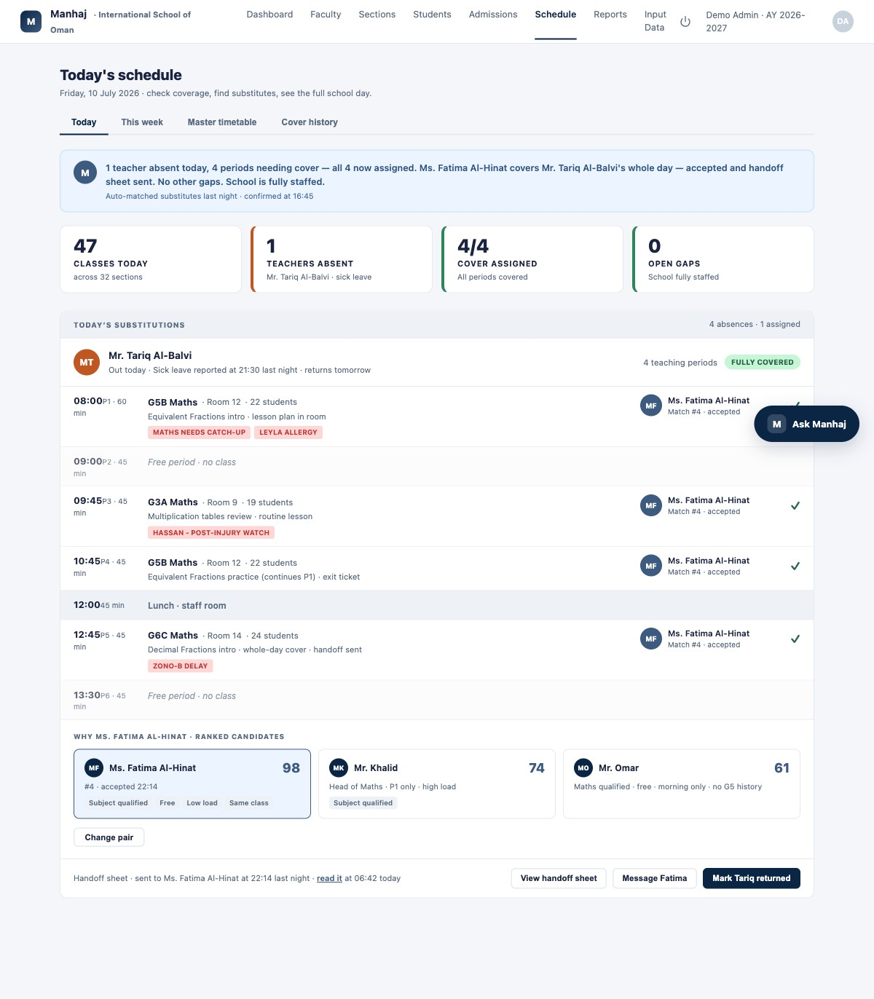
- **Built:** a substitute-**coverage** view — today's absences, per-period cover, ranked candidate substitutes ("why Ms Fatima"), handoff actions; tabs for This Week / Master Timetable / Cover History.
- **Not built:** the **automatic timetable generator** (the CP-SAT auto-scheduler — a Phase 1 item) is not demonstrated; the coverage data is placeholder.
- **Going forward:** connect the substitute finder to real absence data; integrate the timetable generator (the engine already exists in your codebase).

### A8 · Reports — 🟠 Partial
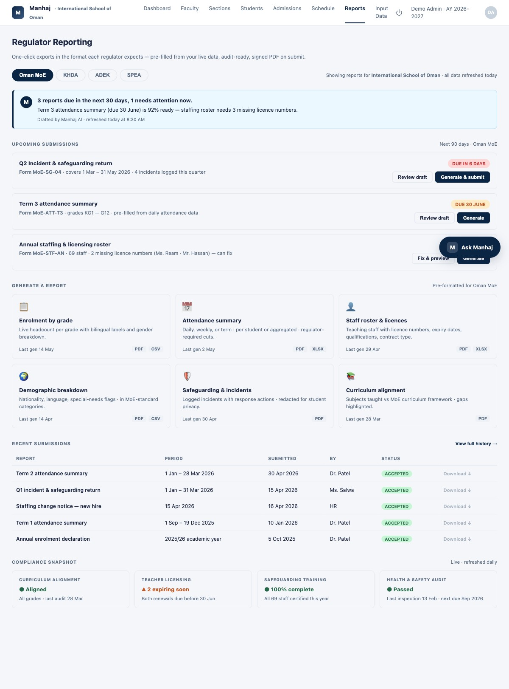
Intended as two halves: **regulator reports** and a **parent-communications pipeline**.
- **Built:** the regulator-reporting half (Oman MoE / KHDA / ADEK / SPEA tabs, upcoming submissions, generate-a-report, compliance snapshot).
- **Not built:** the **parent-comms pipeline** (draft → approve → send) exists only as a **disabled "Send batch" card** on the Input page; regulator data is placeholder.
- **Going forward:** build the parent-comms pipeline; connect regulator reports to real submission data.

## TEACHER

### T1 · One-Tap Attendance — 🟡 Demo
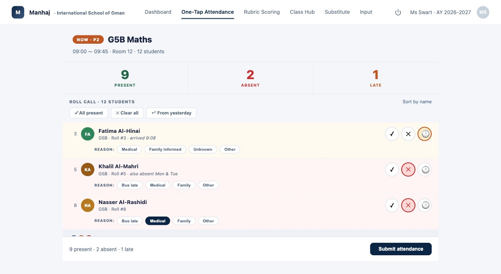
- **Built:** a polished roll-call — present/absent/late counts, "all present / clear / from yesterday" shortcuts, per-student toggles with absence-reason chips, a Submit button.
- **Not built:** **Submit saves nothing** (no data is written); the class list is sample data.
- **Going forward:** connect the roster to real classes and make Submit write attendance to the database (this feeds the parent digest, at-risk flags and regulator reports).

### T2 · Rubric Scoring — 🟡 Demo
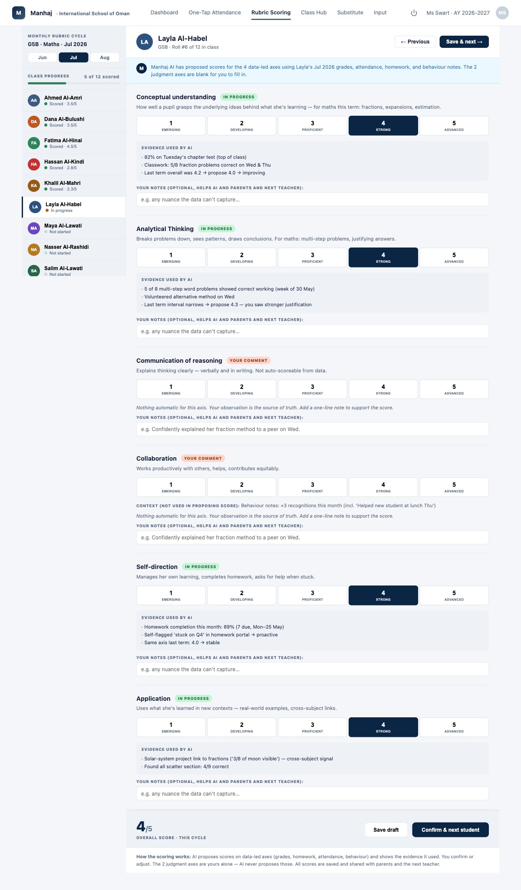
- **Built:** a very complete screen — 12-student sidebar with scored/in-progress states, month cycle, **6 rubric axes** (4 AI-proposed with evidence + 2 judgement-only), save-draft / confirm-and-next.
- **Not built:** real students/scores; the AI suggestion engine; saving.
- **Going forward:** connect students and grades; wire scoring to save; connect the AI suggestions.

### T3 · Class Summary / Lesson Plan — 🟡 Demo
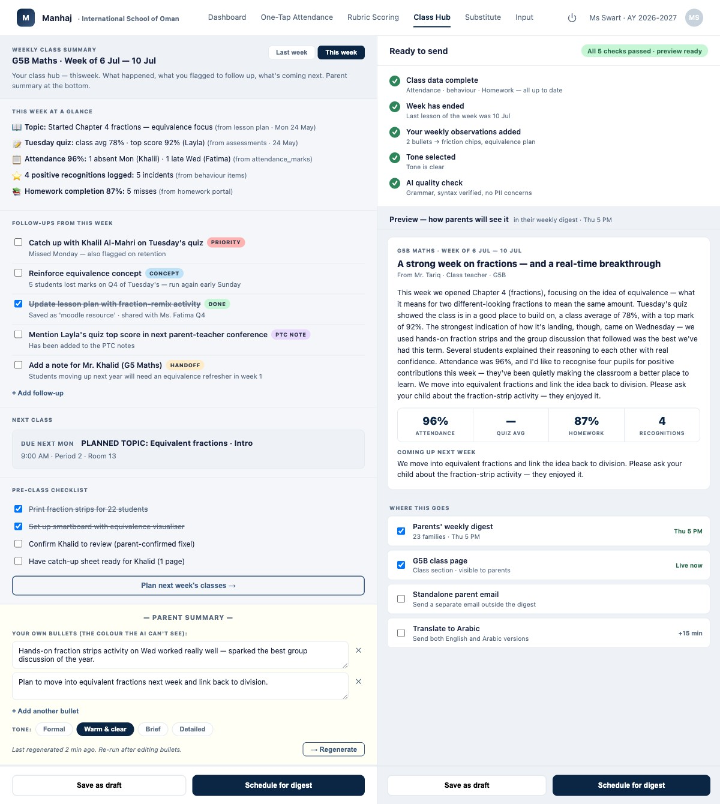
- **Built:** week-at-a-glance, follow-up checkboxes, next-class checklist, and a **parent-summary generator** (tone toggle, live preview, routing to digest / email / Arabic).
- **Not built:** real lesson/class data; saving follow-ups; the AI generator engine.
- **Going forward:** connect to real timetable/lesson data; wire saving and the generator.

### T6 · Substitute Handoff — 🟡 Demo
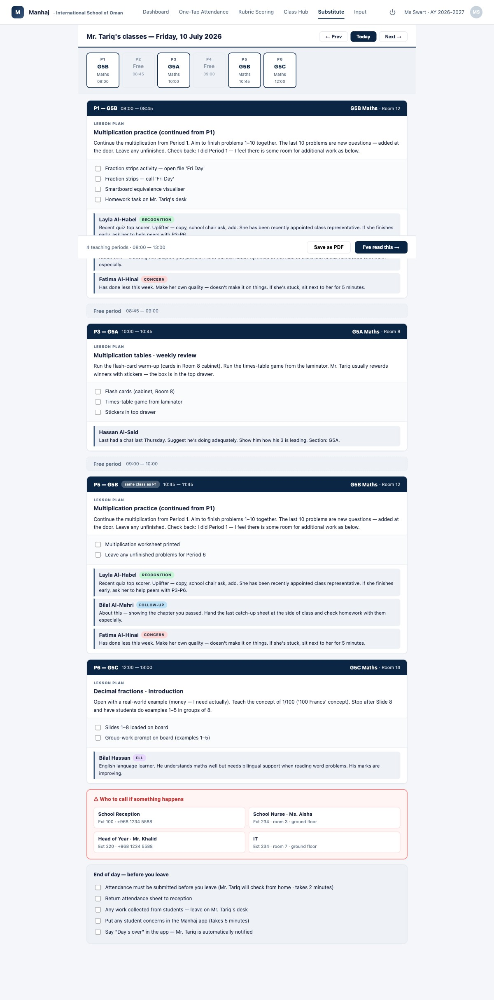
- **Built:** a full per-period handoff sheet — lesson plans, prep checklists, student flags, emergency contacts, "Save PDF".
- **Not built:** real data from an actual absence; PDF generation/saving.
- **Going forward:** auto-build this from a real approved staff absence (links to the A4 sick-leave queue).

### Teacher goal-setting — 🔴 Missing
There is **no teacher-side screen to set a goal for a student** (intended in Phase 1). Goals appear only on the student side.
- **Going forward:** add a teacher goal-setting surface that writes to the same goals used by students.

### T-dash · Teacher Dashboard *(bonus)* — 🟡 Demo
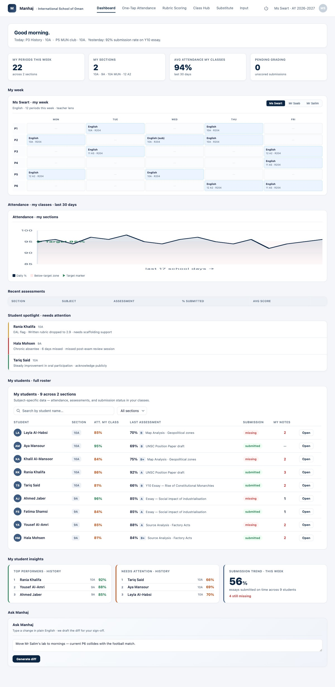
Built: greeting, KPI tiles, weekly timetable, attendance chart, student roster (9 real-looking students), spotlight, insights. "Recent assessments" is empty; data is sample.

## PARENT

### P1 · Weekly Digest — 🟡 Demo
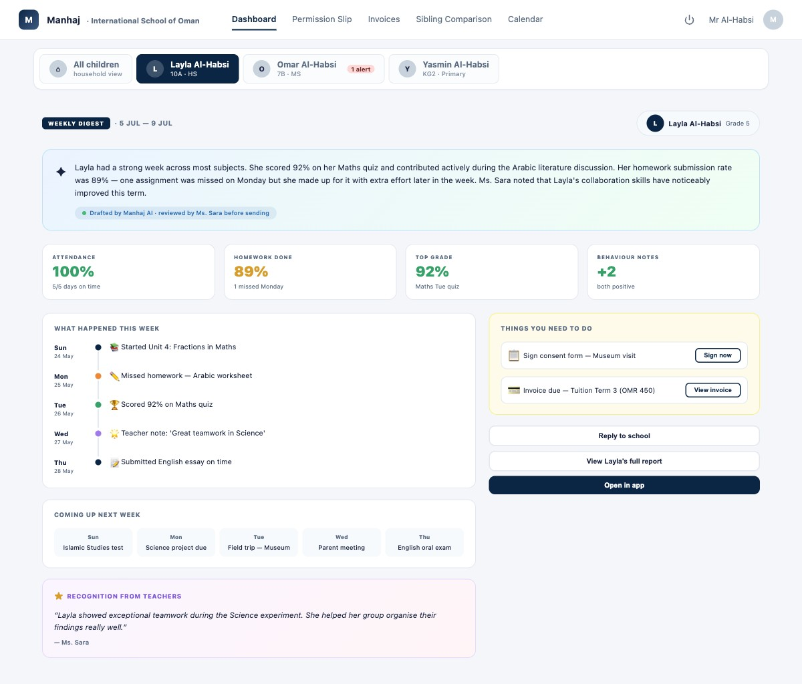
- **Built:** a rich per-child weekly summary — child switcher (Layla / Omar / Yasmin), AI digest ("reviewed by teacher"), KPI tiles, a timeline of what happened / what's coming, teacher recognition, and a "things you need to do" list (Sign / View invoice).
- **Not built:** real child data (there are only 2 parent records in the database for 23 students, so this is thin); sending real digests; **one data inconsistency** (Layla shows "Grade 5" here but "10A" in the switcher).
- **Going forward:** connect real family data; fix the grade inconsistency; wire the digest send.

### P4 · Permission Slip — 🟡 Demo
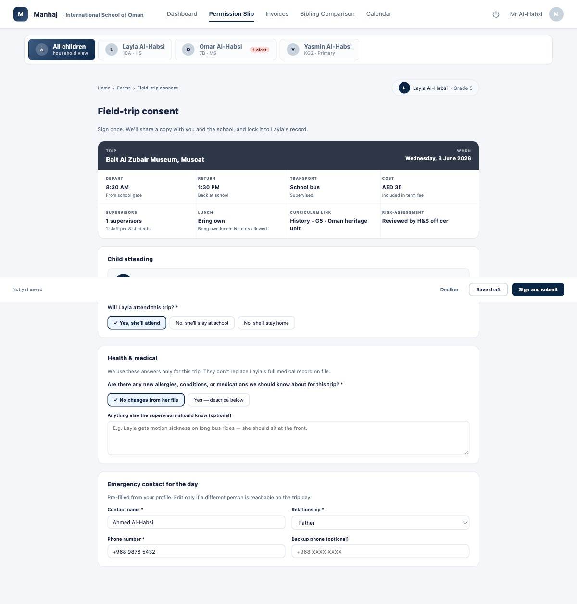
- **Built:** a working consent form — trip details, attend yes/no, health note, pre-filled emergency contact, decline / save-draft / sign-and-submit.
- **Not built:** real trips/activities; saving the signed slip.
- **Going forward:** connect activities and persist submissions + consent records.

### P5 · Invoice / Payment — 🟡 Demo
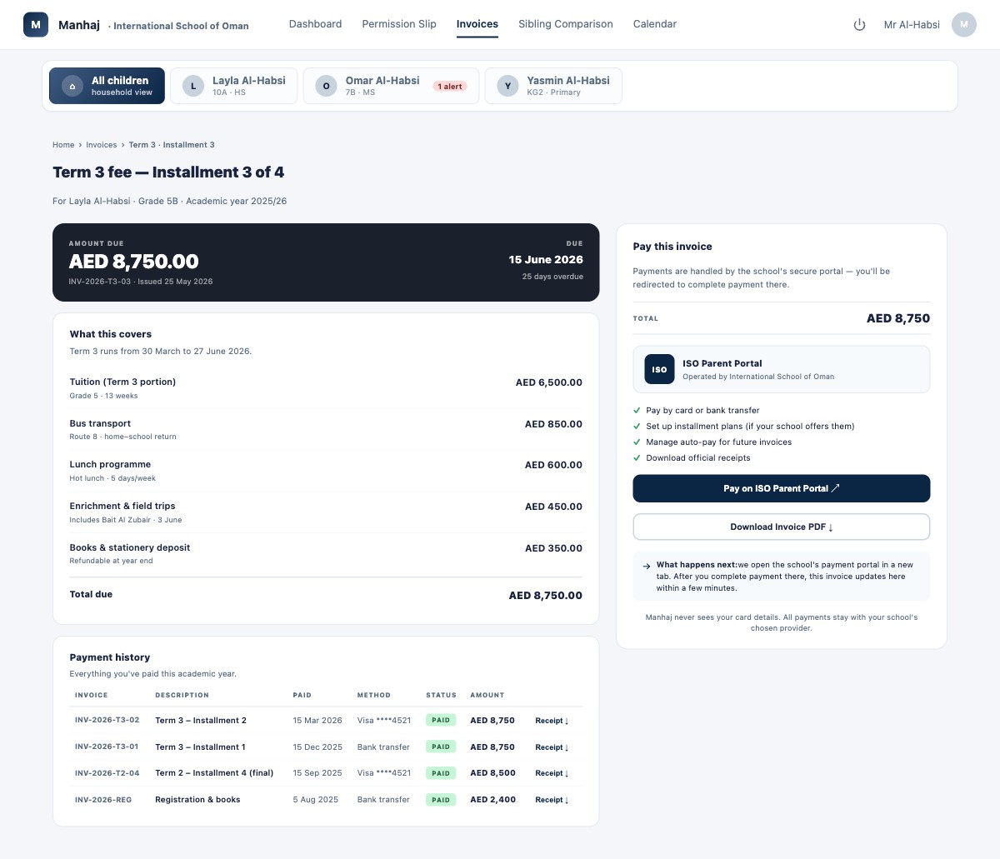
- **Built:** amount due, line items, payment-history with receipts, and a pay panel that hands off to the school's **external ISO Parent Portal** (deliberately no in-app card handling in Phase 1).
- **Not built:** real invoice data; the payment status coming back from the school's file.
- **Going forward:** connect real invoices + bank reference codes (read-only, as intended).

### P6 · Sibling Comparison — 🟡 Demo
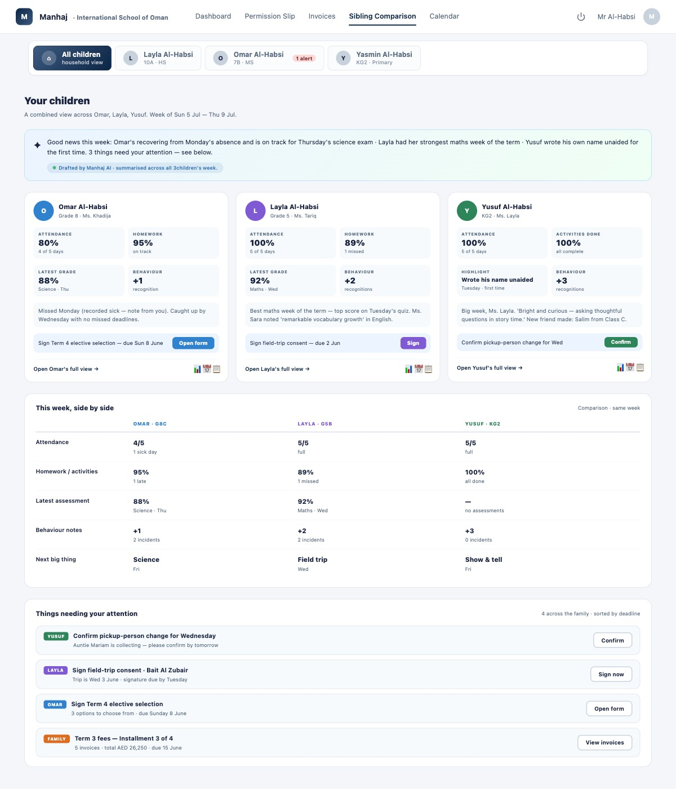
- **Built:** a complete one-household view — three child cards, a side-by-side comparison table, a family action list.
- **Not built:** real per-child data.
- **Going forward:** connect to live attendance/grades/rubric per child.

### Parent Calendar & Course-Selection *(bonus)* — 🟡 Demo
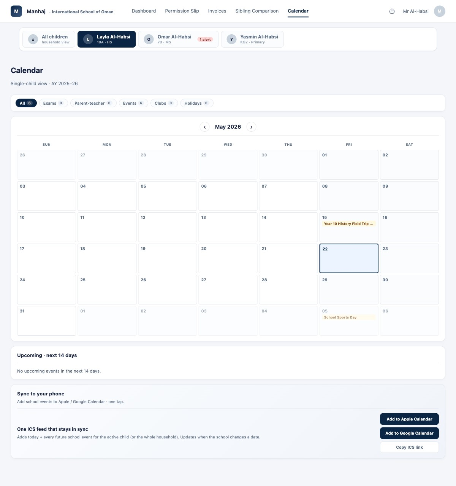
Calendar with month grid, event filters and **real calendar-sync links** (Apple/Google). A bilingual (EN/AR) **course-selection wizard** also exists (reachable from the dashboard, not in the menu). Both are demo-data but well-built. Minor: the calendar's "upcoming" counter is inconsistent, and it logs one error.

## STUDENT

### S1 · My Goals — 🟡 Demo
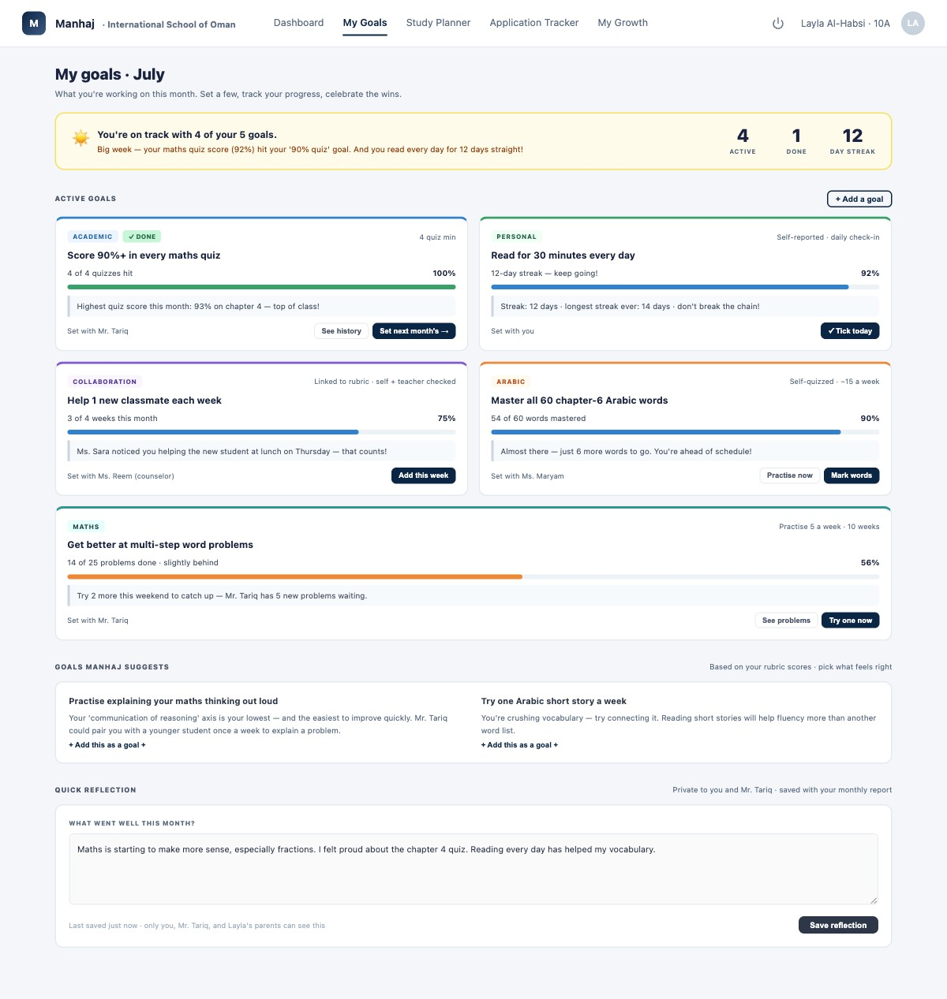
- **Built:** active goals with progress + streaks, AI-suggested goals, a private reflection box.
- **Not built:** real goals/progress; saving; the AI suggestions.
- **Going forward:** connect goals to real progress data and make setting/saving work (shared with the missing teacher goal-setting screen).

### S2 · Study Planner — 🟡 Demo
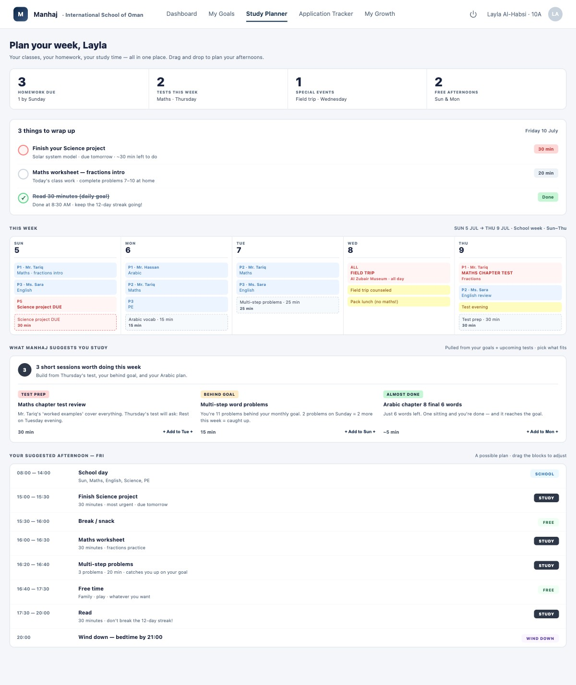
- **Built:** a weekly plan — to-do list, weekly grid, AI study suggestions, a suggested-afternoon schedule.
- **Not built:** real timetable/homework; saving the adjusted plan.
- **Going forward:** connect the real timetable + homework and persist the student's plan.

### S3 · University / Application Tracker — 🟡 Demo
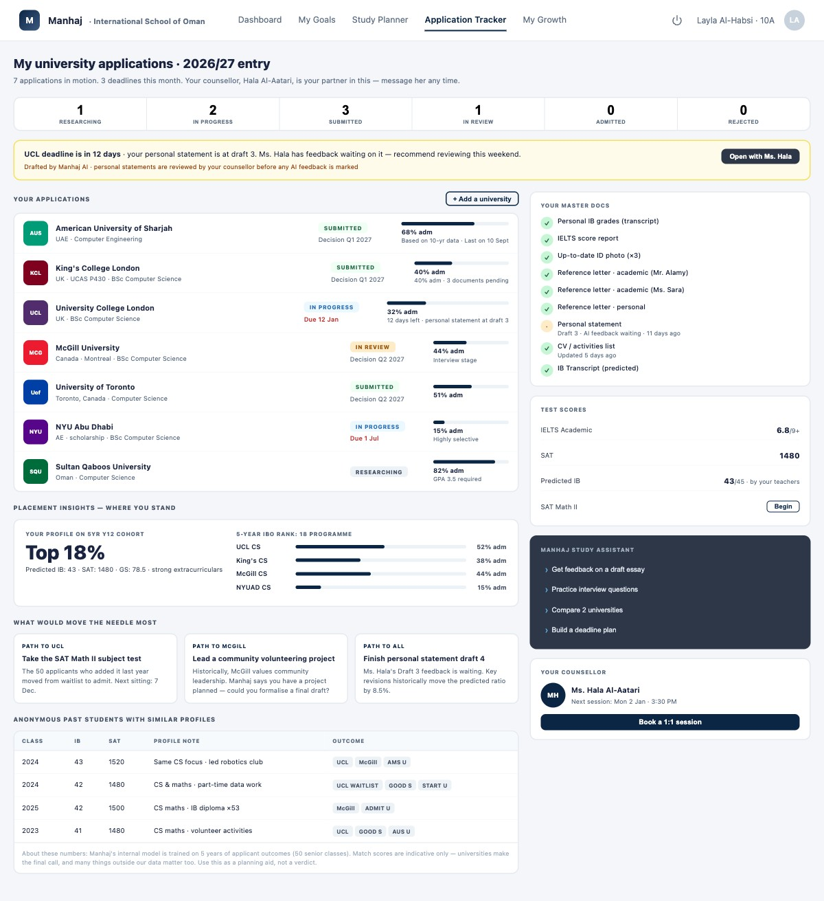
- **Built:** a very complete tracker — application stages, 7 universities, placement insights, anonymous cohort comparison, master documents, test scores, counsellor booking.
- **Not built:** real applications/grades/references; saving.
- **Going forward:** connect real senior-student application data.

### S-growth · My Growth *(bonus)* — 🟡 Demo
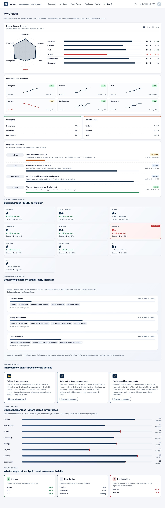
A rich analytics page: 6-axis growth radar (this vs last month), sparklines, strengths/growth, subject grades, university-placement signal, improvement plan and percentiles. Impressive, entirely demo data.

### S-dash · Student Dashboard — 🟠 Partial
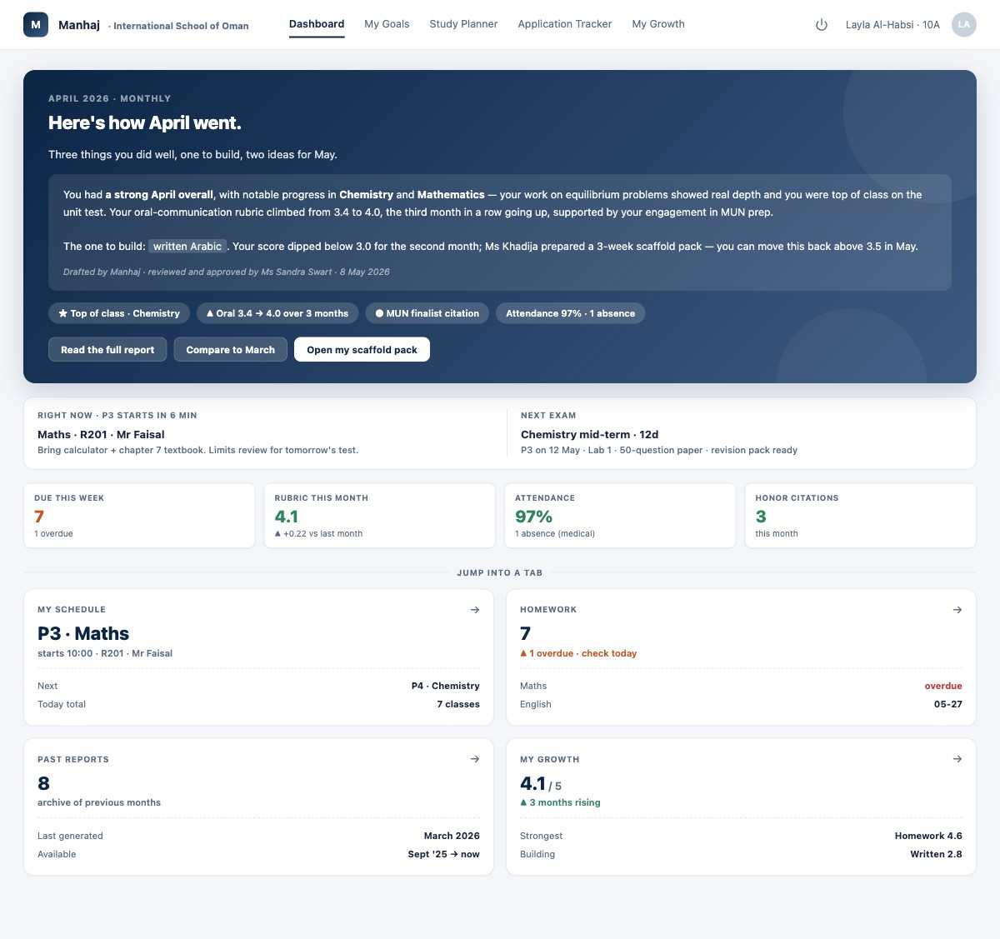
Built: monthly briefing, today snapshot, KPI tiles. **Broken:** the "jump into a tab" cards link to broken addresses (same bug as the admin dashboard) and 404.

---

# 3 · Going-forward plan

Phase 1's remaining work falls into four waves. The first is tiny and high-impact; the bulk is the data-wiring the whole product depends on.

### Wave 0 — Stop the bleeding (hours, not days)
- **Fix the dashboard link bug** (Admin + Student cards, Admin Input cards) — one shared fix removes every "page not found."
- **Finish the database cutover** to the new (emouawad1) database — see the separate cutover runbook; resolves the two-live-databases risk.
- **Hide or clearly label** the disabled buttons (Upload, Send batch) and dead buttons so nothing looks broken to a customer.

### Wave 1 — Connect the real data (the core of "finishing Phase 1")
The single biggest theme: **most screens are demos.** Turn them into a product by connecting them to your live database, one area at a time, starting with what already has real data behind it:
- Make the **Faculty** page show all 105 teachers with real workload + department.
- Make **teacher attendance** actually save, then feed it into the **(new) admin attendance analytics** screen.
- Wire **students / at-risk / admissions** to live records and make the action buttons work.
- Connect **parent** digest / invoices / permission slips and **student** goals / planner / tracker to real data.

### Wave 2 — Build the missing screens
- **Admin attendance analytics (A6)** — currently absent.
- **Teacher goal-setting** — currently absent.
- **Manage-Admins (A1)** — currently absent.
- **Sick-leave approval queue (A4)** and the **auto-scheduling generator (A7)**.
- **Parent-communications pipeline (A8)** — currently a disabled stub.

### Wave 3 — Turn on the intelligence
- Restore the **AI features** (the "Ask Manhaj" and "Generate" buttons everywhere) — the engine (`/api/chat`) is offline.

### How this connects to what's already moving
- These waves are captured as **Sprint 1** in the PM board (`docs/pm/sprints/sprint-01.md`), prioritised the same way.
- **Blocker to start building:** the live-site source code isn't in your repository yet. Once your developer pushes it (or you get repo access), the specialists can begin fixing these as reviewed, approved changes.

---

## Appendix · How this was assessed
Read-only walkthrough of all 33 live pages across the four user types (via the demo login), with 25 full-page screenshots captured for evidence, plus a read-only audit of the database. No data was created or changed. Full page-by-page inventory: `docs/pm/reviews/assets/phase1-visual-inventory.md`. Functional + database detail: `docs/pm/reviews/2026-07-10-phase1-review.md`.
